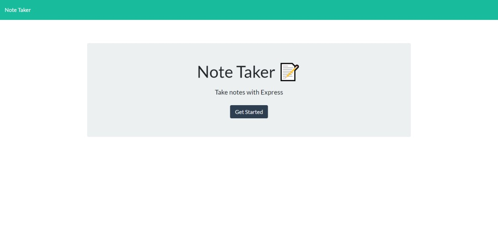

# [Notebook](https://radiant-dawn-93459.herokuapp.com/)

## Description
The goal of this assignment was to explore the process of establishing the client and server relationship by creating a server-side API. With the given frontend, the backend had to be designed to create, save, view and delete notes via a JSON file. It accomplishes the following User Story:
> AS A user, I want to be able to write and save notes.
> 
> I WANT to be able to delete notes I've written before,
> 
> SO THAT I can organize my thoughts and keep track of tasks I need to complete.

These are the routes created to view the HTML pages:
* `/notes` displays the all saved notes and the space to create a new note
* `/` and `*` (any invalid route) directs to the home page

To view a JSON of all notes go to the `/api/notes` route.

**New Class Concepts**: POST & DELETE HTTP requests, Express.js, Routing, Postman, Deploying with Heroku

## Challenges
I had a hard time figuring out how to identify notes with an `id`. I also found what I think is a bug in the given code for the frontend because when the first note had an `id` of 0, as expected with the first item in an array, its contents didn't get displayed when it was clicked on. Therefore, the `id`s had to start at 1.

I also wish the page reloaded to render the notes again when a note is added or deleted. I thought that was in the `index.js` given, but I couldn't find it when I looked again later on. Other than that, the assignment really wasn't too difficult. Deploying to Heroku a second time was easier than that first time.

## Sources
1. [Static Directories](https://www.tutorialspoint.com/expressjs/expressjs_static_files.htm)
2. [Same Route, Different Request](https://expressjs.com/en/api.html#app.route)
3. [Routing w/ URL parameters](https://webapplog.com/url-parameters-and-routing-in-express-js/)
4. [Writing to the server's JSON](https://stackoverflow.com/questions/33113125/save-a-json-file-to-server-in-express-node)
5. [Understanding Express.js body-parser middleware](https://codewithhugo.com/parse-express-json-form-body/)
